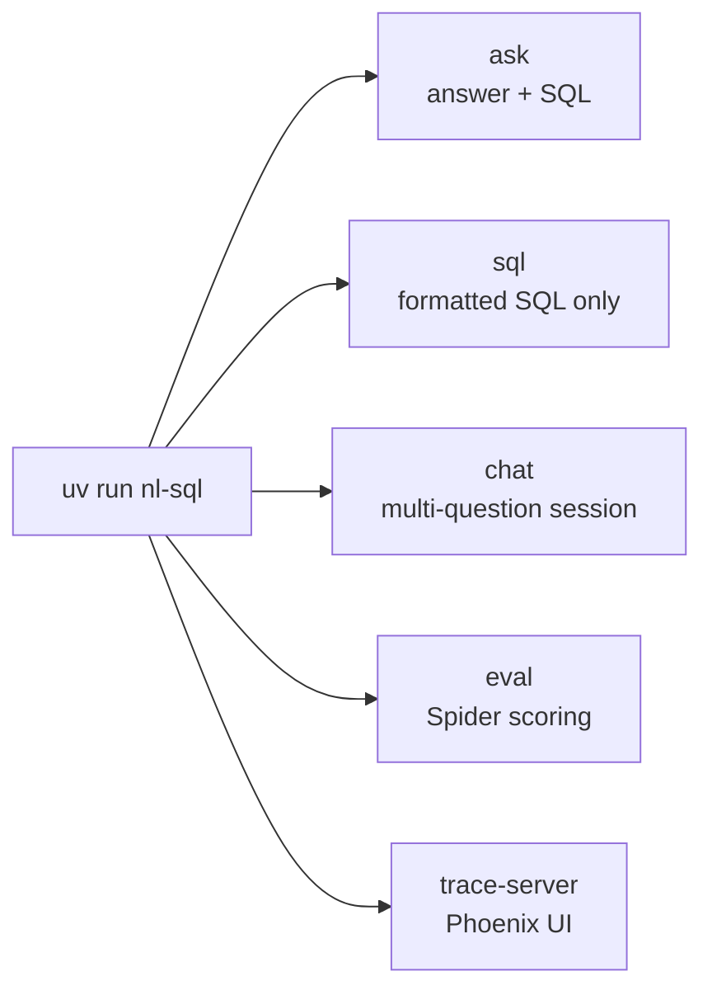
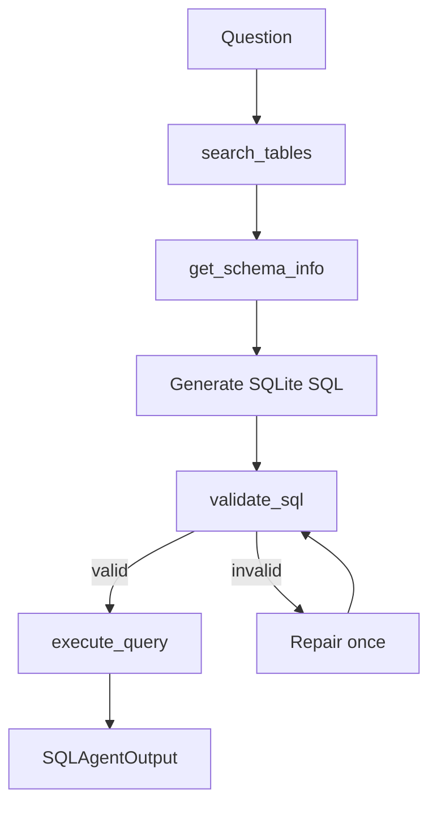
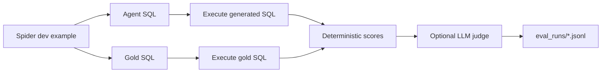

# AGENTS.md

This file is the operational handoff for coding agents working on this repository. Read it before changing code. It captures the project intent, important design decisions from the conversation, command workflows, and constraints that should not drift.

## Project Intent

This repo implements a `uv`-managed SQLite NL-to-SQL command-line agent. It is intentionally built as an agent evaluation harness, not just a demo translator.

Core goals established in the conversation:

- Use SQLite everywhere for v1.
- Use the OpenAI Agents SDK from `openai/openai-agents-python` via the `openai-agents` package, imported as `agents`.
- Provide a CLI that can:
  - answer a one-off natural-language question,
  - return only formatted SQL,
  - run an interactive multi-question session,
  - evaluate against Spider dev data,
  - run Phoenix tracing locally.
- Persist the Spider dev subset in the repo so tests/evals do not need to download data every time.
- Use Spider gold SQL for deterministic scoring.
- Use an LLM judge as a secondary semantic-equivalence signal.
- Use Phoenix/OpenTelemetry/OpenInference for open-source tracing, not OpenAI-hosted tracing.
- Make README and architecture docs readable for future contributors.
- Keep the repo Apache-2.0 licensed.

## Conversation Decision Log

The project evolved through these explicit user requirements:

1. Build a Natural Language to SQL agent as an OpenAI Agents SDK harness with tool-based reasoning.
2. Use SQLite everywhere so local development, Spider evals, and tests run against the same database runtime.
3. Make the project `uv` based and expose it through a command-line interface.
4. Add Phoenix/OpenTelemetry tracing as an open-source tracing backend.
5. Capture useful trace data for improving the agent: system prompt, LLM calls, generated SQL, tool inputs/outputs, validation, execution, repair attempts, judge calls, and final scores.
6. Add Spider evaluation data from the official Spider source and run evals locally against SQLite databases.
7. Persist the Spider dev subset in the repo instead of downloading it for every test run.
8. Prune unused Spider files to save storage while keeping the files required by the harness.
9. Compare generated SQL with Spider gold SQL using deterministic metrics and an LLM judge.
10. Keep LLM-backed and Spider-backed tests behind explicit pytest markers.
11. Add a SQL-only CLI mode that returns formatted SQL for a natural-language question.
12. Add an interactive multi-question CLI session.
13. Ensure the NL-to-SQL agent uses `openai/openai-agents-python`, not a hand-rolled model loop.
14. Improve the prompt and use Pydantic structured output for the final agent response.
15. Improve README readability, especially by replacing the dense architecture diagram with smaller diagrams.
16. Keep this `AGENTS.md` updated so future coding agents can work without reconstructing the conversation.

## Current User-Facing Workflows

The repo supports five main workflows:



The repo also has a setup/start script for local services:

```bash
scripts/start_services.sh
```

It runs `uv sync`, installs UI dependencies if needed, verifies Spider data, and starts Phoenix, the FastAPI backend, and the Vite streaming chat UI. Logs go to `.cache/services/`, which is intentionally ignored by git.

The agent workflow is:



The evaluation workflow is:



## Current Architecture

Main package: `src/nl_sql_agent`

- `agent.py`: OpenAI Agents SDK harness. Defines `DataAnalystAgent`, SDK tools, and `Runner.run`.
- `cli.py`: Typer CLI. Commands: `ask`, `sql`, `chat`, `eval`, `trace-server`, `data download-spider`.
- `sqlite_tools.py`: SQLite schema search, schema introspection, SQL validation, and read-only execution.
- `sql_safety.py`: SQL parsing, normalization, formatting, and read-only guardrails.
- `spider.py`: Spider dev-subset loader and verifier.
- `downloader.py`: Official Spider downloader plus pruning to the files this repo uses.
- `evaluator.py`: Spider eval loop and JSONL artifact writing.
- `scoring.py`: Deterministic SQL scoring and result hashing.
- `judge.py`: LLM-as-judge prompt and structured response parser.
- `tracing.py`: Phoenix/OpenTelemetry tracing helpers.

Important non-code files:

- `README.md`: user-facing setup, architecture, CLI, eval, tracing, and data docs.
- `LICENSE`: Apache License 2.0.
- `pyproject.toml`: package metadata, dependencies, CLI entry point, pytest markers.
- `.gitattributes`: Git LFS tracking for Spider SQLite database files.
- `.gitignore`: ignores caches, generated eval artifacts, downloaded archives, and trace artifacts.
- `ui/src/main.tsx`: ChatGPT-style streaming UI that consumes `/api/chat/stream`.
- `ui/src/styles.css`: UI layout and component styling.

## OpenAI Agents SDK Contract

Do not replace the agent with a hand-rolled Chat Completions loop.

The NL-to-SQL agent must keep using these SDK primitives:

- `Agent`
- `@function_tool`
- `Runner.run`
- `RunConfig`
- `SQLiteSession` for multi-question CLI sessions where needed
- `output_type=SQLAgentOutput` for Pydantic-validated final responses

The regression test `tests/test_agents_sdk_usage.py` exists to catch drift from this design.

The intended tool loop is:

1. `search_tables`
2. `get_schema_info`
3. generate SQLite SQL
4. `validate_sql`
5. `execute_query`
6. repair once if validation/execution fails
7. summarize answer and expose generated SQL

The prompt in `agent.py` is intentionally operational: it requires schema discovery before SQL, validation before execution, one repair attempt, and final answers grounded in executed results.

Final agent output is structured with Pydantic:

- `answer`
- `sql`
- `tables_used`
- `row_count`
- `truncated`
- `validation_error`
- `confidence`

Keep the tool-executed SQL as the source of truth for CLI/eval scoring, because it is captured after validation/execution.

When changing the agent, preserve these behaviors:

- Schema discovery happens through tools.
- SQL must be SQLite dialect.
- SQL is validated before execution.
- Final output remains Pydantic structured.
- CLI/eval should prefer validated/executed SQL over free-form final text.
- OpenAI-hosted tracing stays disabled unless the user explicitly asks for it.

## CLI Commands

Install dependencies:

```bash
uv sync
```

Ask one question and print answer plus SQL:

```bash
uv run nl-sql ask --db data/spider/spider_data/database/concert_singer/concert_singer.sqlite "How many singers do we have?"
```

Generate only formatted SQL:

```bash
uv run nl-sql sql --db data/spider/spider_data/database/concert_singer/concert_singer.sqlite "How many singers do we have?"
```

Generate raw single-line SQL:

```bash
uv run nl-sql sql --db data/spider/spider_data/database/concert_singer/concert_singer.sqlite "How many singers do we have?" --raw
```

Interactive multi-question session:

```bash
uv run nl-sql chat --db data/spider/spider_data/database/concert_singer/concert_singer.sqlite
```

Interactive SQL-only session:

```bash
uv run nl-sql chat --db data/spider/spider_data/database/concert_singer/concert_singer.sqlite --sql-only
```

Persist context across separate one-shot invocations:

```bash
uv run nl-sql ask --db data/spider/spider_data/database/concert_singer/concert_singer.sqlite --session-id concert-demo "How many singers do we have?"
uv run nl-sql sql --db data/spider/spider_data/database/concert_singer/concert_singer.sqlite --session-id concert-demo "Show them by country"
```

Run a Spider dev eval slice:

```bash
uv run nl-sql eval --dataset spider --data-dir data/spider --split dev --limit 25 --output eval_runs/spider_dev_25.jsonl
```

Run without the LLM judge:

```bash
uv run nl-sql eval --dataset spider --data-dir data/spider --split dev --limit 25 --no-judge
```

Run Phoenix locally:

```bash
uv run nl-sql trace-server
```

Then in another terminal:

```bash
NL_SQL_TRACE_MODE=full uv run nl-sql eval --dataset spider --data-dir data/spider --split dev --limit 1 --judge
```

Start all local services together:

```bash
scripts/start_services.sh
```

Common variants:

```bash
scripts/start_services.sh --trace-mode full
scripts/start_services.sh --skip-ui
scripts/start_services.sh --skip-install
```

The UI is intentionally modeled as a ChatGPT-like analyst console: sidebar database selector, suggested prompts, streaming assistant response, visible reasoning/tool timeline, generated SQL block, validation errors, confidence, and trace metadata. Keep `/api/chat/stream` compatible with this event flow if changing backend streaming.

## Data Contract

The repo intentionally tracks only the Spider dev subset needed by this harness:

```text
data/spider/spider_data/README.txt
data/spider/spider_data/dev.json
data/spider/spider_data/tables.json
data/spider/spider_data/database/*/*.sqlite
```

Unused Spider files were removed to save storage:

- `test_database/`
- train/test JSON
- gold SQL files not needed by the loader
- schema dumps
- CSV source files
- annotations and link/q files
- downloaded `spider.zip`
- macOS zip metadata

The downloader is idempotent. It reuses existing verified data by default. With `--force`, it downloads the official Spider archive and prunes it back to the files listed above.

Do not reintroduce the full Spider archive unless the harness is expanded to use those files.

## Evaluation Design

Primary deterministic score: execution accuracy/result match.

The scorer compares generated SQL and gold SQL by executing both against the same SQLite DB. Exact SQL string match is tracked, but it is not the primary score because semantically equivalent SQL often differs from gold SQL.

Artifacts are JSONL under `eval_runs/` and are ignored by git.

Each eval record includes:

- question
- `db_id`
- generated SQL
- gold SQL
- validation result
- execution result hashes
- deterministic scores
- optional LLM judge verdict
- final answer

The LLM judge is secondary. It compares question, schema, gold SQL, generated SQL, and result summaries, and returns:

- `equivalent`
- `score`
- `reason`
- `issues`
- `preferred_sql`

## Tracing Design

Tracing is Phoenix/OpenTelemetry/OpenInference based.

OpenAI-hosted Agents SDK tracing is disabled by default in `agent.py` with `set_tracing_disabled(True)`.

Trace modes:

- `off`: no Phoenix export.
- `redacted`: hashes prompts/SQL/results, captures metadata.
- `full`: captures system prompt, user question, generated SQL, final answer, tool inputs, tool outputs, validation output, execution output, and judge data.

Use `full` mode only when the trace payload is safe to inspect locally.

Useful spans:

- `agent.run`
- `tool.search_tables`
- `tool.get_schema_info`
- `tool.validate_sql`
- `tool.execute_query`
- `eval.llm_judge`
- OpenInference OpenAI spans when Phoenix collector is running

## Guardrails

The SQL toolchain must stay read-only:

- allow a single `SELECT` or `WITH` statement
- reject DDL, DML, PRAGMA, ATTACH, DETACH, VACUUM, and multi-statements
- open SQLite DBs read-only where possible
- enforce row caps in tool code, not just prompt instructions
- validate with `sqlglot` and `EXPLAIN QUERY PLAN` before execution

Do not relax these guardrails without adding tests.

## Tests

Fast default test suite:

```bash
uv run pytest
```

Marked Spider test:

```bash
uv run pytest -m spider_eval
```

Marked LLM test:

```bash
uv run pytest -m llm_eval
```

Default tests must remain deterministic and should not call OpenAI.

Use marked tests for API-backed or benchmark-backed behavior.

Current default test expectation:

```text
27 passed, 2 deselected
```

This count can change as tests are added, but default `uv run pytest` should remain fast and deterministic.

## README Expectations

The README is user-facing and should stay readable. Prefer several small diagrams over one dense architecture graph.

Keep these README sections current when changing behavior:

- Quick Start
- Architecture At A Glance
- Agent Tool Loop
- Evaluation Pipeline
- OpenAI Agents SDK Usage
- Structured Output
- CLI Commands
- Evaluation Metrics
- LLM Judge
- Tracing Details
- Data Persistence

## Commit And Push Notes

The active branch has been `main`, tracking `origin/main` at `git@github.com:nmadhire-agents/nl-sql-agent.git`.

Before committing:

1. Check `git status --short --branch`.
2. Ensure the diff contains only intended changes.
3. Run `uv run pytest` for code changes and documentation changes that touch commands or project structure.
4. Commit with a concise imperative message.
5. Push to `origin/main` when the user asks to commit and push.

Recent relevant commits before this handoff update:

- `d2ce1e5 Add SQL-only CLI command`
- `0e2bfaa Add interactive CLI sessions`
- `9f72a66 Add agent handoff guide`
- `0726026 Add structured agent output schema`
- `a0ee3aa Improve README architecture docs`

Current default test themes:

- OpenAI Agents SDK usage
- CLI registration and formatting
- downloader idempotency and pruning
- SQL safety
- SQLite schema/tool behavior
- deterministic scoring
- Spider dev-subset loading
- judge prompt/schema validation
- tracing redaction/full behavior

## Environment

Expected `.env` values:

```bash
OPENAI_API_KEY=
NL_SQL_DEFAULT_DB_PATH=
NL_SQL_MAX_ROWS=100
NL_SQL_QUERY_TIMEOUT_SECONDS=10
NL_SQL_TRACE_BACKEND=phoenix
PHOENIX_COLLECTOR_ENDPOINT=http://localhost:6006/v1/traces
NL_SQL_TRACE_MODE=redacted
NL_SQL_AGENT_MODEL=gpt-4.1-mini
NL_SQL_JUDGE_MODEL=gpt-4.1-mini
```

## Git and Storage Notes

- Spider SQLite files are tracked through Git LFS.
- `data/spider/spider_data` is intentionally tracked.
- `data/spider/spider.zip`, `data/spider/__MACOSX/`, `.cache/`, `eval_runs/`, and traces are ignored.
- The old full Spider data existed in earlier commits. The current HEAD tracks the trimmed dev subset.

## Before Committing

Run:

```bash
uv run pytest
```

For changes touching Spider data or the eval loader, also run:

```bash
uv run pytest -m spider_eval
```

For changes touching LLM judge behavior, run the marked LLM test only when API usage is acceptable:

```bash
uv run pytest -m llm_eval
```
