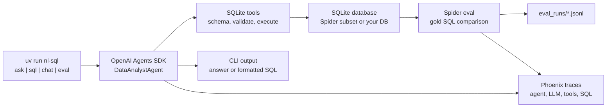
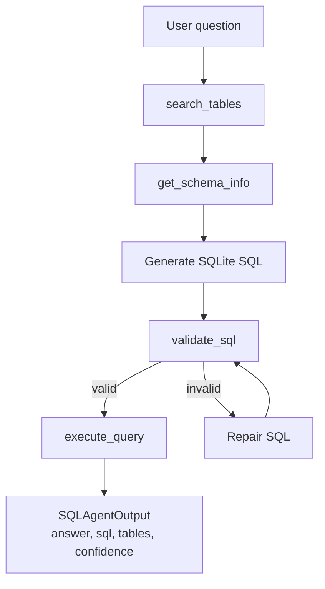
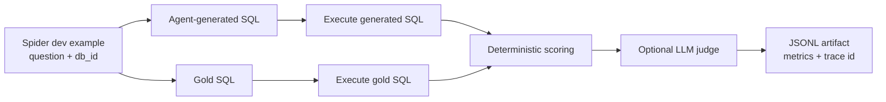

# SQLite NL-to-SQL Agent

`nl-sql-agent` is a `uv`-managed command-line agent that turns natural-language questions into SQLite SQL. It uses the OpenAI Agents SDK for tool-based reasoning, a persisted Spider dev subset for evaluation, Phoenix/OpenTelemetry for open-source tracing, and an optional LLM judge for semantic SQL comparison.

The project is built as an evaluation harness, not just a demo. You can ask one question, run a multi-question CLI session, evaluate against Spider gold SQL, inspect Phoenix traces, and compare deterministic execution accuracy with LLM judge results.

## Quick Start

```bash
uv sync
cp .env.example .env
# Add OPENAI_API_KEY=... to .env
```

To start the local tracing server, API backend, and UI together:

```bash
scripts/start_services.sh
```

Ask a question against the included Spider SQLite data:

```bash
uv run nl-sql ask \
  --db data/spider/spider_data/database/concert_singer/concert_singer.sqlite \
  "How many singers do we have?"
```

Return only formatted SQL:

```bash
uv run nl-sql sql \
  --db data/spider/spider_data/database/concert_singer/concert_singer.sqlite \
  "How many singers do we have?"
```

Run a small Spider evaluation slice:

```bash
uv run nl-sql eval --dataset spider --data-dir data/spider --split dev --limit 25
```

Run fast deterministic tests:

```bash
uv run pytest
```

## What It Does

- Converts natural-language questions into SQLite SQL.
- Uses the OpenAI Agents SDK (`openai-agents`, imported as `agents`) for agent orchestration.
- Discovers schema through tools instead of putting the whole database schema in the prompt.
- Validates SQL with `sqlglot` and SQLite `EXPLAIN QUERY PLAN`.
- Executes only read-only `SELECT` and `WITH` queries.
- Evaluates generated SQL against Spider gold SQL.
- Scores validation, execution, exact SQL match, result-set match, latency, retries, and judge verdicts.
- Captures local open-source traces with Phoenix/OpenTelemetry.

## Architecture At A Glance

The top-level system has four moving parts: the CLI, the OpenAI Agents SDK agent, SQLite tools, and evaluation/tracing outputs.



## Agent Tool Loop

The agent is intentionally forced through tool-based discovery and validation before it executes SQL.



## Evaluation Pipeline

Spider evaluation runs locally against SQLite databases. The agent never sees the gold SQL before generating its answer.



## OpenAI Agents SDK Usage

The NL-to-SQL workflow is implemented as an OpenAI Agents SDK harness, not as a custom chat-completions loop. The agent code lives in `src/nl_sql_agent/agent.py` and uses these SDK primitives from [`openai/openai-agents-python`](https://github.com/openai/openai-agents-python):

- `Agent`: defines `DataAnalystAgent`, its instructions, model, output schema, and tools.
- `@function_tool`: exposes SQLite discovery, validation, and execution as typed tools.
- `Runner.run`: executes the agent loop and allows tool calls across turns.
- `RunConfig`: attaches workflow metadata.
- `output_type=SQLAgentOutput`: validates the final response with Pydantic.

There is a regression test that imports the SDK symbols and verifies `ask_agent` still references `Agent`, `Runner.run`, `function_tool`, and `RunConfig`.

## Structured Output

The final agent response is validated with Pydantic through the Agents SDK `output_type` parameter. The schema is `SQLAgentOutput`:

```json
{
  "answer": "There are 6 singers.",
  "sql": "SELECT count(*) FROM singer",
  "tables_used": ["singer"],
  "row_count": 1,
  "truncated": false,
  "validation_error": null,
  "confidence": "high"
}
```

The CLI still treats the SQL captured from validated and executed tools as the source of truth for `nl-sql sql` and eval scoring. The structured response keeps downstream harness work machine-readable.

## Repository Layout

```text
src/nl_sql_agent/
  agent.py          OpenAI Agents SDK agent and tool wiring
  cli.py            Typer CLI commands
  config.py         Environment-driven settings
  downloader.py     Idempotent Spider downloader
  evaluator.py      Spider eval loop and JSONL artifacts
  judge.py          LLM-as-judge prompt and structured output
  scoring.py        Deterministic SQL scoring and result hashing
  spider.py         Spider dataset loader and verifier
  sql_safety.py     SQLite read-only SQL validation
  sqlite_tools.py   Schema discovery, validation, execution tools
  tracing.py        Phoenix/OpenTelemetry tracing helpers

tests/
  test_*.py         Fast deterministic tests plus marked eval tests

data/spider/
  spider_data/      Persisted Spider dev subset used by evals and tests
```

## Configuration

Create a local `.env` file:

```bash
cp .env.example .env
```

Set at least:

```bash
OPENAI_API_KEY=...
```

Useful environment variables:

```bash
NL_SQL_DEFAULT_DB_PATH=
NL_SQL_MAX_ROWS=100
NL_SQL_QUERY_TIMEOUT_SECONDS=10
NL_SQL_TRACE_BACKEND=phoenix
PHOENIX_COLLECTOR_ENDPOINT=http://localhost:6006/v1/traces
NL_SQL_TRACE_MODE=redacted
NL_SQL_AGENT_MODEL=gpt-4.1-mini
NL_SQL_JUDGE_MODEL=gpt-4.1-mini
```

## CLI Commands

### Start Local Services

Use the setup/start script when you want the local services running together:

```bash
scripts/start_services.sh
```

The script runs `uv sync`, installs UI dependencies when needed, verifies the Spider SQLite data exists, and starts:

- Phoenix tracing at `http://127.0.0.1:6006`
- FastAPI backend at `http://127.0.0.1:8080`
- Vite CopilotKit chat UI at `http://127.0.0.1:5173`

Useful options:

```bash
scripts/start_services.sh --trace-mode full
scripts/start_services.sh --skip-ui
scripts/start_services.sh --skip-trace
scripts/start_services.sh --skip-install
```

Service logs are written to `.cache/services/`. Press `Ctrl+C` in the script terminal to stop all services it started.

### Download Or Verify Spider Data

```bash
uv run nl-sql data download-spider --output data/spider
```

`download-spider` is idempotent. It reuses the existing verified `data/spider` directory by default. Use `--force` only when you intentionally want to redownload and re-extract the dataset:

```bash
uv run nl-sql data download-spider --output data/spider --force
```

After a forced download, the downloader prunes Spider to the files this harness uses: `dev.json`, `tables.json`, and `database/*/*.sqlite`.

### Ask One Question

```bash
uv run nl-sql ask \
  --db data/spider/spider_data/database/concert_singer/concert_singer.sqlite \
  "How many singers do we have?"
```

### Generate SQL Only

```bash
uv run nl-sql sql \
  --db data/spider/spider_data/database/concert_singer/concert_singer.sqlite \
  "How many singers do we have?"
```

Example output:

```sql
SELECT
  COUNT(*) AS singer_count
FROM singer
```

Use `--raw` for normalized single-line SQL:

```bash
uv run nl-sql sql \
  --db data/spider/spider_data/database/concert_singer/concert_singer.sqlite \
  "How many singers do we have?" \
  --raw
```

### Ask Multiple Questions In One Session

```bash
uv run nl-sql chat \
  --db data/spider/spider_data/database/concert_singer/concert_singer.sqlite
```

Inside the session:

```text
nl-sql: How many singers do we have?
nl-sql: Show them by country
nl-sql: :exit
```

Use `--sql-only` to print only SQL during the interactive session:

```bash
uv run nl-sql chat \
  --db data/spider/spider_data/database/concert_singer/concert_singer.sqlite \
  --sql-only
```

For conversation context across separate CLI invocations, pass the same `--session-id`:

```bash
uv run nl-sql ask \
  --db data/spider/spider_data/database/concert_singer/concert_singer.sqlite \
  --session-id concert-demo \
  "How many singers do we have?"

uv run nl-sql sql \
  --db data/spider/spider_data/database/concert_singer/concert_singer.sqlite \
  --session-id concert-demo \
  "Show them by country"
```

By default, persisted one-shot sessions use `.cache/nl_sql_agent_sessions.sqlite`. Interactive `chat` sessions are in-memory unless you pass `--session-store`.

### Run Evaluations

Small local eval slice:

```bash
uv run nl-sql eval \
  --dataset spider \
  --data-dir data/spider \
  --split dev \
  --limit 25 \
  --output eval_runs/spider_dev_25.jsonl
```

Disable the LLM judge:

```bash
uv run nl-sql eval \
  --dataset spider \
  --data-dir data/spider \
  --split dev \
  --limit 25 \
  --no-judge
```

Run the full persisted Spider dev split:

```bash
uv run nl-sql eval \
  --dataset spider \
  --data-dir data/spider \
  --split dev \
  --limit 1034 \
  --judge \
  --output eval_runs/spider_dev_full_with_judge.jsonl
```

The full dev split makes one agent call per example and, with `--judge`, one additional judge call per example. Runtime and API usage scale with `--limit`.

### Start Tracing

Start Phoenix in one terminal:

```bash
uv run nl-sql trace-server
```

Run an eval or ask command in another terminal:

```bash
NL_SQL_TRACE_MODE=full uv run nl-sql eval \
  --dataset spider \
  --data-dir data/spider \
  --split dev \
  --limit 1 \
  --judge
```

## Evaluation Metrics

Each eval record includes:

- `validation_success`: generated SQL passed parser and safety checks.
- `execution_success`: generated SQL ran against SQLite without database errors.
- `exact_sql_match`: normalized generated SQL exactly matched normalized gold SQL.
- `result_match`: generated SQL and gold SQL returned the same canonicalized result.
- `generated_result_hash`: stable hash of generated result values.
- `gold_result_hash`: stable hash of gold result values.
- `latency_seconds`: wall-clock runtime for that example.
- `judge`: optional LLM semantic equivalence verdict.

Execution accuracy is the main deterministic score because semantically correct SQL often differs from Spider gold SQL text. For example, these are equivalent for evaluation even though they do not exactly match:

```sql
SELECT COUNT(*) AS singer_count FROM singer;
SELECT count(*) FROM singer;
```

The scorer compares result values rather than output column aliases, so harmless alias differences do not count as failures.

## LLM Judge

The LLM judge compares the natural-language question, relevant schema, gold SQL, generated SQL, gold execution result summary, and generated execution result summary.

It returns structured JSON:

```json
{
  "equivalent": true,
  "score": 5,
  "reason": "Both queries count rows in the singer table.",
  "issues": [],
  "preferred_sql": "tie"
}
```

Use the judge as a secondary metric. The deterministic result match is still the primary benchmark signal.

## Tracing Details

Tracing modes:

- `off`: no Phoenix export.
- `redacted`: captures hashes, timings, row counts, validation status, and table names, but not full prompts, SQL text, or result rows.
- `full`: captures system prompt, user question, generated SQL, final answer, tool inputs, tool outputs, validation output, execution output, and LLM judge data. Values are truncated to keep spans bounded.

OpenAI-hosted Agents SDK tracing is disabled by default. Phoenix receives local OpenTelemetry/OpenInference spans when the collector is running.

Useful trace spans:

- `agent.run`: user question, system prompt, final answer, generated SQL.
- `tool.search_tables`: schema search input and returned candidate tables.
- `tool.get_schema_info`: selected tables and schema payload.
- `tool.validate_sql`: generated SQL and validation output.
- `tool.execute_query`: SQL execution output, row count, truncation state.
- `eval.llm_judge`: judge call metadata.
- OpenInference spans: OpenAI client calls when instrumentation is active.

Recommended improvement loop:

1. Run a small Spider slice with `NL_SQL_TRACE_MODE=full`.
2. Inspect failed examples in Phoenix.
3. Compare schema discovery, generated SQL, validation errors, and judge reasons.
4. Adjust agent instructions, search heuristics, or tool outputs.
5. Re-run the same slice and compare JSONL artifacts.

## Tests

Default tests are deterministic and do not call an LLM:

```bash
uv run pytest
```

Spider-backed smoke tests require `data/spider`:

```bash
uv run pytest -m spider_eval
```

LLM-backed tests require `OPENAI_API_KEY` and Spider data:

```bash
uv run pytest -m llm_eval
```

Default coverage includes SQL safety validation, SQLite schema discovery, query validation and execution caps, result canonicalization and hashing, Spider loader behavior, downloader idempotency, LLM judge prompt/schema validation without model calls, and tracing redaction/full-mode payload behavior.

## Data Persistence

The persisted Spider dev subset is expected to live at:

```text
data/spider/spider_data
```

The repository tracks only the files used by this harness:

```text
data/spider/spider_data/README.txt
data/spider/spider_data/dev.json
data/spider/spider_data/tables.json
data/spider/spider_data/database/*/*.sqlite
```

Unused Spider files such as `test_database`, train/test JSON, schema dumps, CSV sources, annotations, and the downloaded zip archive are intentionally removed or ignored to keep repository size lower. The redundant downloaded archive and macOS zip metadata remain ignored:

```text
data/spider/spider.zip
data/spider/__MACOSX/
```

## License

This project is licensed under the Apache License 2.0. See [LICENSE](LICENSE).


### CopilotKit UI (Beautiful Chat + Reasoning)

Run the FastAPI backend:

```bash
uv run nl-sql web --host 127.0.0.1 --port 8080
```

In another terminal run the UI:

```bash
cd ui
npm install
npm run dev
```

The UI provides a polished chat window and is wired to display answer quality, SQL output, and agent reasoning captured from tracing-aware agent runs.

The UI uses a ChatGPT-style layout with a persistent SQLite database selector, prompt suggestions, streaming answer text, visible agent reasoning/tool steps, generated SQL, validation errors, confidence, and trace metadata. The browser calls the FastAPI streaming endpoint at `/api/chat/stream`, which emits server-sent events for status updates, tool calls, SQL, final answer, and errors.
