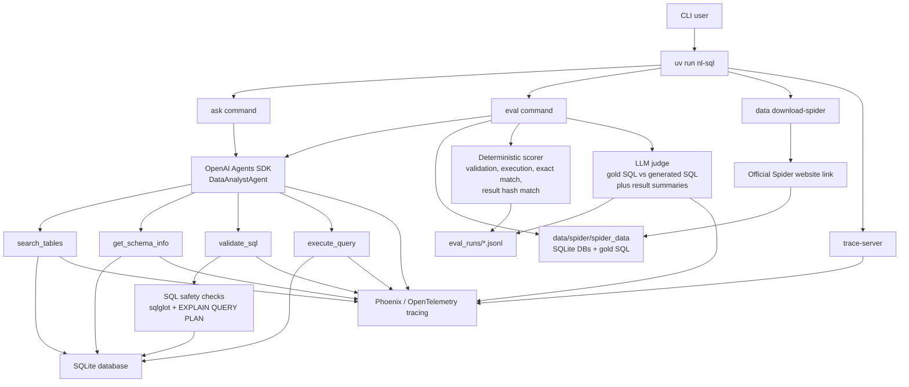
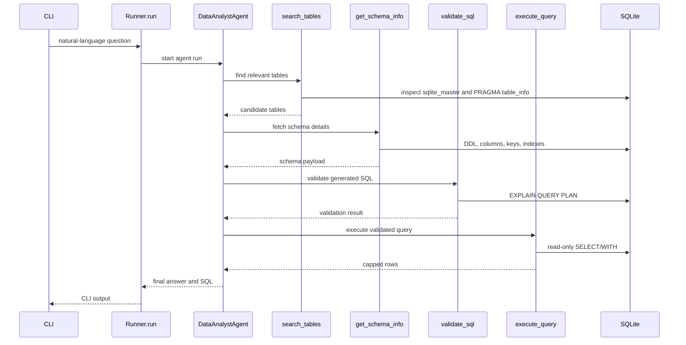

# SQLite NL-to-SQL Agent

`nl-sql-agent` is a `uv`-managed command-line natural-language-to-SQL agent. It uses SQLite as the only database runtime, the OpenAI Agents SDK for tool-based reasoning, Spider as the local benchmark dataset, an LLM judge for semantic SQL comparison, and Phoenix/OpenTelemetry for open-source tracing.

The project is built for harness engineering: you can run one question interactively, evaluate the persisted Spider dev subset, inspect generated SQL and tool calls in Phoenix, and compare generated SQL against gold SQL with deterministic execution metrics plus an LLM judge.

## What It Does

- Converts natural-language questions into SQLite SQL.
- Discovers schema through tools instead of stuffing all schema into the prompt.
- Uses the OpenAI Agents SDK (`openai-agents`, imported as `agents`) for agent orchestration.
- Validates SQL before execution with `sqlglot` and SQLite `EXPLAIN QUERY PLAN`.
- Executes only read-only `SELECT`/`WITH` queries against SQLite.
- Evaluates generated SQL against Spider gold SQL.
- Uses execution accuracy as the primary deterministic metric.
- Uses an LLM judge as a secondary semantic equivalence check.
- Captures tracing data for prompt and tool improvement through Phoenix.

## Architecture



## OpenAI Agents SDK Usage

The NL-to-SQL workflow is intentionally implemented as an OpenAI Agents SDK harness, not as a custom chat-completions loop.

The agent code in `src/nl_sql_agent/agent.py` uses the SDK primitives from [`openai/openai-agents-python`](https://github.com/openai/openai-agents-python):

- `Agent`: defines `DataAnalystAgent`, its instructions, model, and tool list.
- `@function_tool`: exposes SQLite discovery, validation, and execution as typed agent tools.
- `Runner.run`: executes the agent loop and allows the model to call tools across turns.
- `RunConfig`: sets workflow metadata for the run.

The tool-based reasoning path is:



There is also a regression test that imports the SDK symbols and verifies `ask_agent` still references `Agent`, `Runner.run`, `function_tool`, and `RunConfig`.

## Repository Layout

```text
src/nl_sql_agent/
  agent.py          OpenAI Agents SDK agent and tool wiring
  cli.py            Typer CLI commands
  config.py         Environment-driven settings
  downloader.py     Idempotent Spider downloader
  evaluator.py      Spider eval loop and JSONL artifacts
  judge.py          LLM-as-judge prompt and structured output
  scoring.py        Deterministic SQL scoring and result hashing
  spider.py         Spider dataset loader and verifier
  sql_safety.py     SQLite read-only SQL validation
  sqlite_tools.py   Schema discovery, validation, execution tools
  tracing.py        Phoenix/OpenTelemetry tracing helpers

tests/
  test_*.py         Fast deterministic tests plus marked eval tests

data/spider/
  spider_data/      Persisted Spider dev subset used by evals and tests
```

## Setup

Install dependencies with `uv`:

```bash
uv sync
```

Create a local `.env` file:

```bash
cp .env.example .env
```

Set at least:

```bash
OPENAI_API_KEY=...
```

Useful environment variables:

```bash
NL_SQL_DEFAULT_DB_PATH=
NL_SQL_MAX_ROWS=100
NL_SQL_QUERY_TIMEOUT_SECONDS=10
NL_SQL_TRACE_BACKEND=phoenix
PHOENIX_COLLECTOR_ENDPOINT=http://localhost:6006/v1/traces
NL_SQL_TRACE_MODE=redacted
NL_SQL_AGENT_MODEL=gpt-4.1-mini
NL_SQL_JUDGE_MODEL=gpt-4.1-mini
```

## Commands

Download, prune, or verify Spider:

```bash
uv run nl-sql data download-spider --output data/spider
```

`download-spider` is idempotent. It reuses an existing verified `data/spider` download by default. Use `--force` only when you intentionally want to redownload and re-extract the dataset:
After a forced download, the downloader prunes Spider to the files this harness uses: `dev.json`, `tables.json`, and `database/*/*.sqlite`.

```bash
uv run nl-sql data download-spider --output data/spider --force
```

Ask a question against any SQLite database:

```bash
uv run nl-sql ask --db data/spider/spider_data/database/concert_singer/concert_singer.sqlite "How many singers do we have?"
```

Generate only the formatted SQL for a natural-language question:

```bash
uv run nl-sql sql --db data/spider/spider_data/database/concert_singer/concert_singer.sqlite "How many singers do we have?"
```

Example output:

```sql
SELECT
  COUNT(*) AS singer_count
FROM singer
```

Use `--raw` if you want the normalized single-line SQL instead of pretty output:

```bash
uv run nl-sql sql --db data/spider/spider_data/database/concert_singer/concert_singer.sqlite "How many singers do we have?" --raw
```

Run a Spider eval slice:

```bash
uv run nl-sql eval --dataset spider --data-dir data/spider --split dev --limit 25 --output eval_runs/spider_dev_25.jsonl
```

Run with the LLM judge disabled:

```bash
uv run nl-sql eval --dataset spider --data-dir data/spider --split dev --limit 25 --no-judge
```

Run the full persisted Spider dev split:

```bash
uv run nl-sql eval --dataset spider --data-dir data/spider --split dev --limit 1034 --judge --output eval_runs/spider_dev_full_with_judge.jsonl
```

The full dev split makes one agent call per example and, with `--judge`, one additional judge call per example. Expect runtime and API usage to scale with the `--limit`.

## Evaluation Metrics

Each eval record includes:

- `validation_success`: generated SQL passed parser and safety checks.
- `execution_success`: generated SQL ran against SQLite without database errors.
- `exact_sql_match`: normalized generated SQL exactly matched normalized gold SQL.
- `result_match`: generated SQL and gold SQL returned the same canonicalized result.
- `generated_result_hash`: stable hash of generated result values.
- `gold_result_hash`: stable hash of gold result values.
- `latency_seconds`: wall-clock runtime for that example.
- `judge`: optional LLM semantic equivalence verdict.

Execution accuracy is the main deterministic score because semantically correct SQL often differs from Spider gold SQL text. For example, these are equivalent for evaluation even though they do not exactly match:

```sql
SELECT COUNT(*) AS singer_count FROM singer;
SELECT count(*) FROM singer;
```

The scorer compares result values rather than output column aliases, so harmless alias differences do not count as failures.

## LLM Judge

The LLM judge compares:

- Natural-language question
- Relevant schema
- Gold SQL
- Generated SQL
- Gold execution result summary
- Generated execution result summary

It returns structured JSON:

```json
{
  "equivalent": true,
  "score": 5,
  "reason": "Both queries count rows in the singer table.",
  "issues": [],
  "preferred_sql": "tie"
}
```

Use the judge as a secondary metric. The deterministic result match is still the primary signal for benchmark scoring.

## Tracing

Start Phoenix in one terminal:

```bash
uv run nl-sql trace-server
```

Run an eval or ask command in another terminal:

```bash
NL_SQL_TRACE_MODE=full uv run nl-sql eval --dataset spider --data-dir data/spider --split dev --limit 1 --judge
```

Tracing modes:

- `off`: no Phoenix export.
- `redacted`: captures hashes, timings, row counts, validation status, and table names, but not full prompts, SQL text, or result rows.
- `full`: captures system prompt, user question, generated SQL, final answer, tool inputs, tool outputs, validation output, execution output, and LLM judge data. Values are truncated to keep spans bounded.

OpenAI-hosted Agents SDK tracing is disabled by default. Phoenix receives local OpenTelemetry/OpenInference spans when the collector is running.

Useful trace spans:

- `agent.run`: user question, system prompt, final answer, generated SQL.
- `tool.search_tables`: schema search input and returned candidate tables.
- `tool.get_schema_info`: selected tables and schema payload.
- `tool.validate_sql`: generated SQL and validation output.
- `tool.execute_query`: SQL execution output, row count, truncation state.
- `eval.llm_judge`: judge call metadata.
- OpenInference spans: OpenAI client calls when instrumentation is active.

This tracing data is intended to support prompt/tool improvements. Common workflow:

1. Run a small Spider slice with `NL_SQL_TRACE_MODE=full`.
2. Inspect failed examples in Phoenix.
3. Compare schema discovery, generated SQL, validation errors, and judge reasons.
4. Adjust agent instructions, search heuristics, or tool outputs.
5. Re-run the same slice and compare JSONL artifacts.

## Tests

Default tests are deterministic and do not call an LLM:

```bash
uv run pytest
```

Spider-backed smoke tests require `data/spider`:

```bash
uv run pytest -m spider_eval
```

LLM-backed tests require `OPENAI_API_KEY` and Spider data:

```bash
uv run pytest -m llm_eval
```

Default coverage includes:

- SQL safety validation
- SQLite schema discovery
- Query validation and execution caps
- Result canonicalization and hashing
- Spider loader behavior
- Downloader idempotency
- LLM judge prompt/schema validation without model calls
- Tracing redaction and full-mode payload behavior

## Data Persistence

The persisted Spider dev subset is expected to live at:

```text
data/spider/spider_data
```

The repository tracks only the files used by this harness:

```text
data/spider/spider_data/README.txt
data/spider/spider_data/dev.json
data/spider/spider_data/tables.json
data/spider/spider_data/database/*/*.sqlite
```

Unused Spider files such as `test_database`, train/test JSON, schema dumps, CSV sources, annotations, and the downloaded zip archive are intentionally removed or ignored to keep repository size lower. The redundant downloaded archive and macOS zip metadata remain ignored:

```text
data/spider/spider.zip
data/spider/__MACOSX/
```

## License

This project is licensed under the Apache License 2.0. See [LICENSE](LICENSE).
